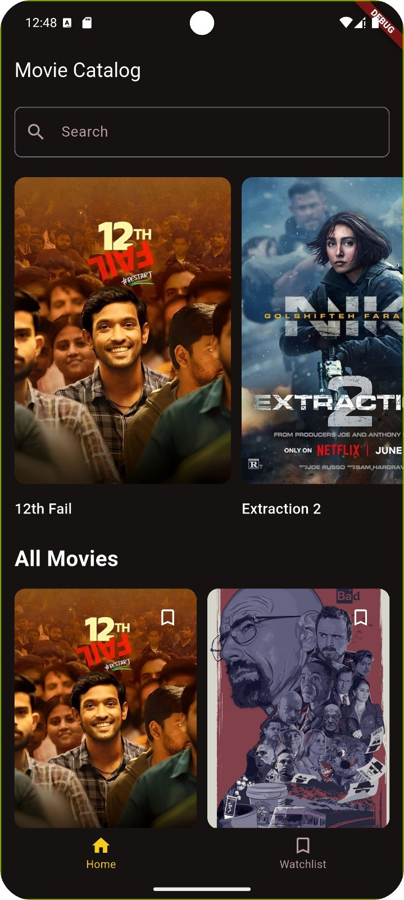
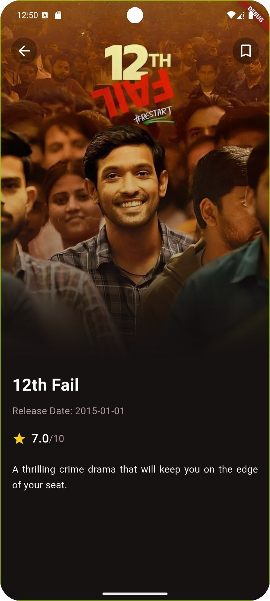
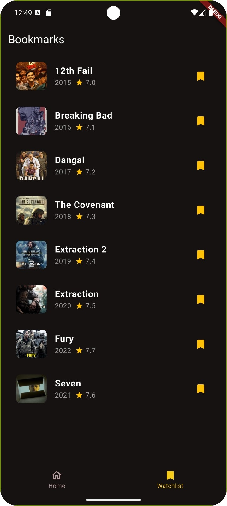

#  Movie Catalog App

 simple movie catalog application built with Flutter. Browse movies, view details, and save your favorites to a personal watchlist.

##  Features

- **Browse Movies**: Discover a wide collection of movies with beautiful poster displays
- **Featured Movies**: Horizontal scrolling section for highlighted films
- **Movie Details**: Detailed view with movie information, ratings, and descriptions
- **Bookmark System**: Save movies to your personal watchlist
- **Dark Theme**: Modern dark UI design for better viewing experience

##  Built With

- **Flutter** - UI framework
- **Dart** - Programming language
- **Provider** - State management

##  Screenshots

<div align="center">
  
  
  
  
</div>

## 📁 Project Structure

```
lib/
├── controllers/
│   └── bookmark_controller.dart
├── helpers/
│   └── themes/
│       └── app_colors.dart
├── models/
│   └── movie_model.dart
├── views/
│   ├── screens/
│   │   ├── home_screen.dart
│   │   ├── movie_details_screen.dart
│   │   ├── watch_list_screen.dart
│   │   └── wrapper_screen.dart
│   └── widgets/
│       ├── featured_movie_item_widget.dart
│   │   ├── grid_movie_item_widget.dart
│   │   └── list_movie_item_widget.dart
└── main.dart
```
